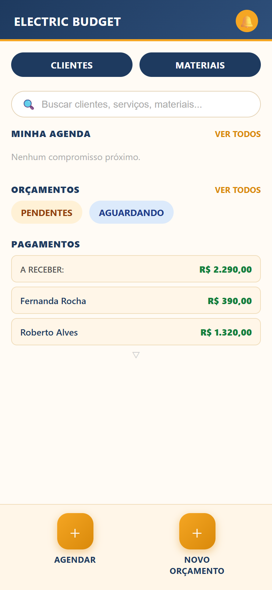
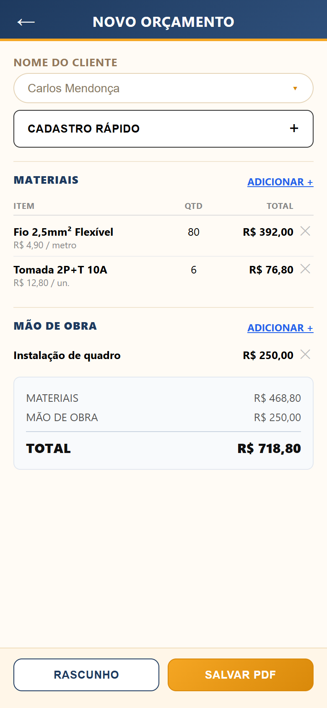
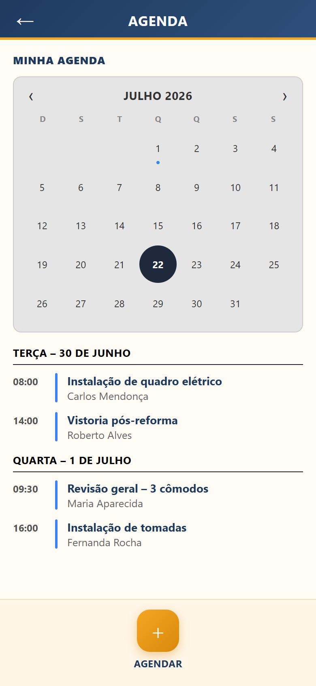
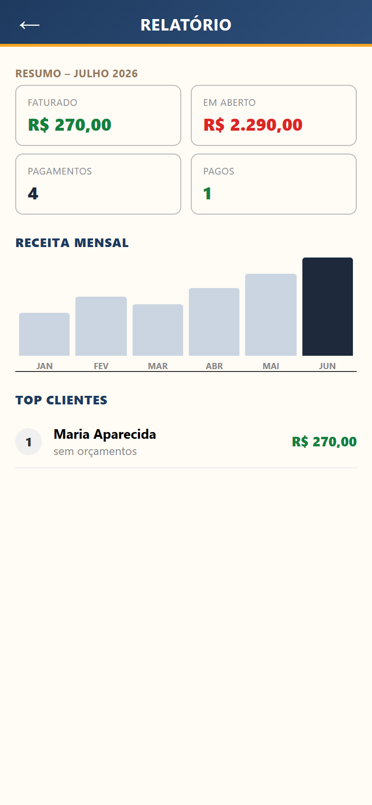
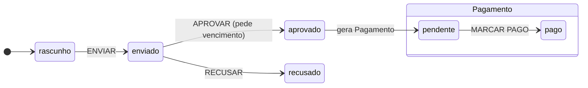

<div align="center">


# Electric Budget

**App de gestão para eletricistas autônomos — orçamentos, agenda, clientes, materiais e pagamentos.**

Feito para o celular na mão, no meio da obra, com ou sem internet.

[](https://erik-gastao.github.io/ElectricBudgetApp/)
[](#-instalar-no-celular)
[](#-arquitetura)

<br>

| Home | Pagamentos | Orçamento |
|:---:|:---:|:---:|
|  |  |  |

| Agenda | Clientes | Relatório |
|:---:|:---:|:---:|
|  |  |  |

</div>

---

## 💡 O problema

Eletricista autônomo gerencia o negócio em caderno e planilha: orçamento feito de cabeça, pagamento esquecido, agenda no papel. O Electric Budget substitui isso por um app que **funciona offline no canteiro de obra** e cabe no bolso — sem mensalidade, sem cadastro, sem servidor.

## ⚡ Funcionalidades

- **Orçamentos** — monta com materiais cadastrados (preço × quantidade) + mão de obra; totais automáticos; **gera PDF profissional** na hora, até sem internet
- **Ciclo de venda completo** — rascunho → enviado → aprovado/recusado; aprovar gera cobrança automaticamente
- **Pagamentos** — pendente/pago com atraso detectado automaticamente pela data de vencimento; filtros por status e mês
- **Agenda** — calendário mensal interativo, compromissos agrupados por dia com labels "HOJE"/"AMANHÃ"
- **Clientes** — cadastro completo, perfil com financeiro (faturado × em aberto) e histórico de orçamentos
- **Materiais** — catálogo com busca, filtro por categoria e edição in-place
- **Relatório** — faturado, em aberto, receita mensal em gráfico e ranking de clientes
- **Notificações** — central com atrasos, vencimentos e compromissos do dia; badge no sino; **cobrança pelo WhatsApp** com mensagem pronta
- **Busca global** — clientes, serviços, materiais e agendamentos num campo só

## 📱 Instalar no celular

1. Abra **https://erik-gastao.github.io/ElectricBudgetApp/** no Chrome
2. Menu **⋮** → **"Adicionar à tela inicial"** (ou "Instalar app")
3. Pronto: abre pelo ícone ⚡ em tela cheia e **funciona sem internet**

> Primeiro acesso precisa de internet (o app se guarda no aparelho). Depois, offline total — inclusive a geração de PDF.

📄 [Exemplo de PDF gerado pelo app](docs/orcamento-exemplo.pdf)

## 🏗 Arquitetura

**Vanilla JS, zero framework, zero build.** Decisão consciente: o protótipo validado em IHC já era HTML/CSS/JS — o app real reaproveita ~100% dele e adiciona as camadas que faltavam.

```
app/
├── index.html          16 telas single-page (navegação por classe .active)
├── style.css           design system completo do protótipo + extensões
├── manifest.json       PWA: standalone, ícones, tema
├── sw.js               service worker: precache + stale-while-revalidate
├── js/
│   ├── db.js           camada IndexedDB (6 stores, índices, transações)
│   └── app.js          lógica de negócio + render + persistência
├── vendor/
│   └── jspdf.umd.min.js  jsPDF local (sem CDN — PDF funciona offline)
└── icons/              ícones PWA (any + maskable)
```

### Dados

IndexedDB `electricbudget` — cinco entidades com **UUID** (`crypto.randomUUID`), referências por id, seed idempotente (só semeia store vazio):

| Store | Índices | Observação |
|-------|---------|------------|
| `clientes` | nome | avatar gerado das iniciais |
| `materiais` | cat, nome | catálogo de preços |
| `orcamentos` | clienteId, status, data | itens persistidos junto — total sempre revalidado |
| `agendamentos` | data | consulta por dia/mês |
| `pagamentos` | clienteId, status, data | `atrasado` **nunca é salvo** — derivado no render |

### Máquina de status



Orçamento rastreia a *venda*; Pagamento rastreia o *dinheiro*. `atrasado` = `pendente` com vencimento no passado, calculado a cada render — nunca dessincroniza.

### Decisões que importam

- **Datas sempre no fuso do aparelho** — `hojeLocal()` em vez de `toISOString()`, que após ~21h (UTC-3) gravaria o dia seguinte e corromperia vencimentos
- **Relógio verificado na abertura** — compara com header `Date` do servidor (online) e com o maior timestamp já visto (offline); relógio errado → aviso, porque todo vencimento depende dele
- **Gravação nunca finge sucesso** — toda escrita em `try/catch`; falhou (quota, aba anônima), o usuário vê erro e o dado fica na tela
- **Service worker só intercepta GET** — o HEAD da verificação de relógio vai direto à rede para ler um `Date` confiável

## 🖥 Rodar local

Sem build, sem dependência — qualquer servidor estático:

```bash
git clone https://github.com/erik-gastao/ElectricBudgetApp.git
cd ElectricBudgetApp
python -m http.server 8080 --directory app
# abre http://localhost:8080
```

Deploy: push na `main` publica sozinho no GitHub Pages (Actions).

## 🧪 Testes

Suíte E2E com Puppeteer + Chrome real cobrindo: seed e hidratação, CRUDs, fluxo aprovar→cobrança, baixa de pagamento, **persistência pós-reload**, idempotência do seed, service worker, **reload 100% offline** e geração/validação do PDF (`%PDF`, totais, nome de arquivo).

## 🗺 Roadmap

- [x] **F0** — estrutura PWA a partir do protótipo
- [x] **F1** — persistência IndexedDB + UUIDs + seed
- [x] **F2** — CRUD real de clientes com `clienteId`
- [x] **F3** — PDF real do orçamento (jsPDF offline)
- [x] **F4** — manifest + service worker → instalável e offline
- [x] **F5** — relatório completo (gráfico real de receita mensal)
- [x] **F6** — notificações (central dinâmica, cobrança via WhatsApp, Notification API)
- [ ] **F7** — Capacitor → Play Store

## 🎨 Origem

Nasceu como [protótipo de IHC](prototipo-referencia/) ([online](https://erik-gastao.github.io/electricbudget/)) — 16 telas desenhadas sobre princípios de visibilidade de estado, controle do usuário, consistência e design para erro. O protótipo segue no repositório como referência de design.

## 👥 Autores

- **Erik Gastão Tavares** — [@erik-gastao](https://github.com/erik-gastao)
